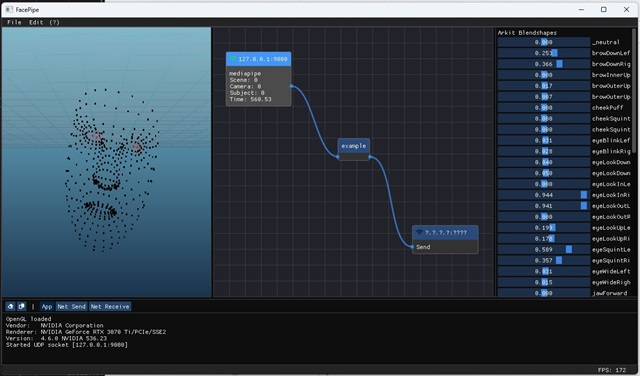
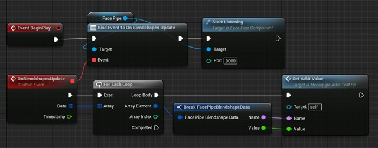

# FacePipe
FacePipe is a prototype application in C++ for receiving, processing and forwarding face tracking data over UDP. It is primarily intended for using landmarks, expression coefficients (blendshapes) and transforms. It uses a basic ASCII protocol per datagram. This is still in a sandbox state and only really useful for testing and debugging.

This application was created by Denny Lindberg and Lisa Gren as part of their thesis.

# Preview
The main application displaying landmarks and expression coefficients from the Python test application using the MediaPipe face landmarker task. The node graph in the middle is a mockup with minimal functionality.

Blueprint nodes from the example Unreal Engine plugin. The last SetArkitValue node is only an example and is not included. The ARKit 52 blendshape values are generated from the Python test application using MediaPipe.

An example of the Unreal Engine plugin applying blendshape values to a character head in Mortal Online 2.

# Usage
**FacePipe C++:** Use premake5 and compile using the steps below. See `Building the code`. The application listens to port 9000 by default. It forwards packets by default over port 9001 and 9002. These ports are for testing the Blender and Unreal Engine examples.

**FacePipe Python**: Run `external/mediapipe_landmarker_udp.py` to start a web camera feed and send packets over UDP on port 9000 by default. FacePipe C++ should automatically receive and display the data.

**FacePipe Blender example**: Open `external/Blender/blender_receive_facepipe.blend` and run the script. Note that the listen port in Blender is set to 9001.

**FacePipe Unreal Engine plugin**: Compile the Unreal Engine plugin inside `external/unreal/FacePipe`. You need to manually copy `facepipe.h/.cpp` to `unreal\FacePipe\Source\FacePipe\ThirdParty\facepipe` if you make any changes to the base protocol. Use the blueprint nodes to start a listen socket and bind events to manage incoming data. This plugin is in an experimental state, it is not intended for production.

# Platform

- C++17
- For Windows
- OpenGL 4.6

# Requirements

- If PYTHON_ENABLED is set, then Python 3.11 needs to be installed in `Program Files` or `Appdata/Local/Programs/Python` for pybind11 to work. This is not really needed unless you want to mess around with it. Update the define via the premake5.lua file.

# Building the code

Get **premake5** for generating makefiles or solutions for your IDE - https://premake.github.io

After downloading it, place the `premake5.exe` in the root folder of the project (... or place it in `Windows/System32` to install it globally on the system). Run `premake5 vs2022` in the terminal or command line to generate a Visual Studio solution (the solution ends up in the temp folder). Open the solution and you're good to go.

# Third party libraries used

**glad** for OpenGL bindings - https://github.com/Dav1dde/glad

**SDL2** for creating a cross-platform OpenGL window with input - https://www.libsdl.org - 2.26.x release

**glm** for vector and matrix data types compatible with OpenGL - https://glm.g-truc.net/0.9.9/index.html

**lodepng** for loading and saving PNG files - https://lodev.org/lodepng/

**tinyobjloader** for loading obj files - https://github.com/syoyo/tinyobjloader

**Dear ImGUI** for the UI - https://github.com/ocornut/imgui

**PyBind11** for the Python interpreter - https://github.com/pybind/pybind11

# Third party assets
**Canonical Head meshes** - From MediaPipe and ARKit SDKs and repositories.

**MediaPipe face landmarker task** - Used by FacePipe Python to run the MediaPipe vision task to resolve landmarks and expression coefficients from a camera feed.

**Font Awesome** - https://fontawesome.com

# Algorithms copied or referenced
**Various GLSL noise algorithms** - Copied: https://gist.github.com/patriciogonzalezvivo/670c22f3966e662d2f83

**Evan's grid shader** - Slightly modified: http://madebyevan.com/shaders/grid/

## Folder structure

**binaries/** - contains compiled executable, dlls, images, configs or audio. (screenshots end up here)

**content/** - mesh, curves, textures and shader files.

**external/** - additional Python code and plugins for other application.

**include/** - thirdparty includes.

**libs/** - windows specific libs.

**source/** - main folder for source code.

**temp/** - is generated by premake5 and contains the solution. This folder can be deleted at any time.